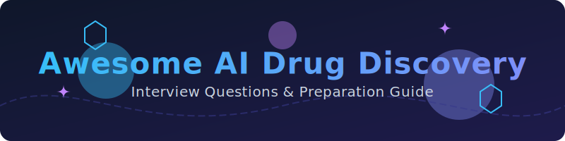

<p align="center">
  
</p>

# 🧬 AI Drug Discovery Scientist Interview Questions 🚀

A curated, community-driven collection of interview questions (with model answers, frameworks, and explanations) for **AI/ML Scientist roles in drug discovery** — spanning biotech startups, pharma R&D, and computational biology labs.

This is not a list of trivia. Every question includes:
- **Why interviewers ask it**
- **A model answer or framework**
- **Follow-up questions** interviewers commonly use to probe deeper

> 🌱 This is v1. Contributions, corrections, and new questions are very welcome — see [CONTRIBUTING.md](CONTRIBUTING.md).

> ⚠️ **Note on scope:** This repo focuses on the ML/computational side of drug discovery (representations, models, validation, pipelines). It assumes some existing background in either machine learning or life sciences (most candidates for these roles come from one side and are learning the other) — it is not a substitute for a biochemistry or ML fundamentals course.

---

## 📚 Table of Contents

| # | Category | What it covers |
|---|----------|-----------------|
| 1 | 💊 [Drug Discovery Fundamentals](questions/01-drug-discovery-fundamentals.md) | The discovery pipeline, target ID, hit-to-lead, ADMET, the DMTA cycle |
| 2 | 🧪 [Molecular Representations & Cheminformatics](questions/02-molecular-representations-cheminformatics.md) | SMILES, fingerprints, graphs, descriptors, similarity |
| 3 | 🤖 [ML Methods for Drug Discovery](questions/03-ml-methods-drug-discovery.md) | QSAR, GNNs, generative models, virtual screening, docking |
| 4 | 🧬 [Structural Biology & Protein Modeling](questions/04-structural-biology-protein-modeling.md) | Structure prediction, structure-based design, protein-ligand interactions |
| 5 | 📊 [Data, Validation & Experimental Design](questions/05-data-validation-experimental-design.md) | Assay data quality, active learning, the wet-lab/dry-lab loop |
| 6 | 📈 [Model Evaluation & Benchmarking](questions/06-model-evaluation-and-benchmarking.md) | Retrospective vs. prospective validation, applicability domain, generalization |
| 7 | ⚖️ [Regulatory, IP & Responsible AI](questions/07-regulatory-ip-responsible-ai.md) | Dual-use risk, regulatory pathways, data/IP considerations |
| 8 | 🤝 [Behavioral & Case Studies](questions/08-behavioral-and-case-studies.md) | Cross-functional collaboration with chemists/biologists, real-world scenarios |

Also see: [resources.md](resources.md) for external reading, papers, benchmarks, and communities.

---

## 🧭 How to Use This Repo

- **Coming from a pure ML/CS background?** Prioritize sections 1, 2, and 4 first — you'll need working fluency in the biology/chemistry vocabulary before your ML skills are useful in this domain.
- **Coming from a computational chemistry / cheminformatics background?** Prioritize section 3 and section 6 — interviewers will want to see you can reason about modern deep learning approaches and rigorous ML validation, not just classical QSAR.
- **Coming from a wet-lab biology/chemistry background moving into a computational role?** Prioritize sections 2, 3, and 5 — the goal is fluency in how your experimental intuition translates into model design and data quality judgments.
- **Interviewing at a company doing structure-based design or protein engineering?** Focus heavily on section 4.
- **Interviewing at a company doing generative/de novo molecule design?** Focus heavily on sections 3 and 6 (validation of generative outputs is a major open challenge and a favorite interview topic).

Each question is tagged with a rough difficulty and role-level indicator:
- 🟢 Junior/Associate Scientist · 🟡 Mid-level Scientist · 🔴 Senior/Principal Scientist

---

## 🗂 Repo Structure

```
ai-drug-discovery-interview-questions/
├── README.md                                          ← you are here
├── CONTRIBUTING.md
├── LICENSE
├── resources.md
└── questions/
    ├── 01-drug-discovery-fundamentals.md
    ├── 02-molecular-representations-cheminformatics.md
    ├── 03-ml-methods-drug-discovery.md
    ├── 04-structural-biology-protein-modeling.md
    ├── 05-data-validation-experimental-design.md
    ├── 06-model-evaluation-and-benchmarking.md
    ├── 07-regulatory-ip-responsible-ai.md
    └── 08-behavioral-and-case-studies.md
```

## 🤝 Contributing

PRs are the whole point of this repo. If you were asked a question in a real interview that isn't here, add it! See [CONTRIBUTING.md](CONTRIBUTING.md) for format guidelines.

## 📄 License

Content is available under [MIT License](LICENSE) — use it freely for your own prep, mock interviews, or hiring loops.

## ⭐ Support

If this helped you land an offer, consider starring the repo and adding the question that stumped you — it might help the next person.
